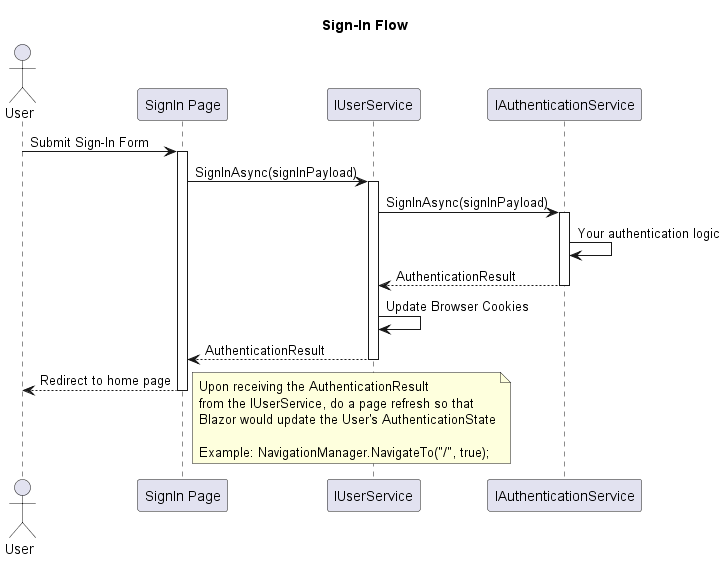
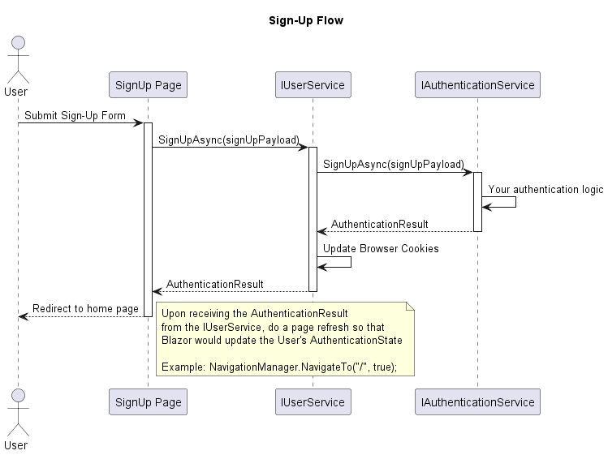
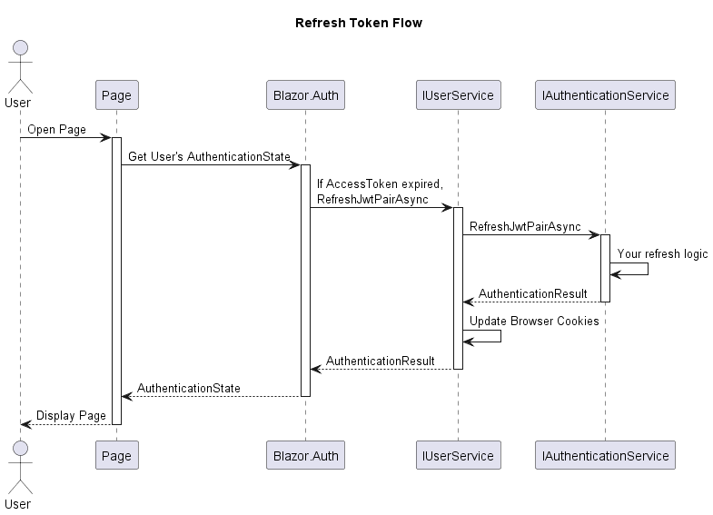

## Architecture

The package works by setting and reading Cookies in User's Browser. The Cookies are used to store the JWT Pair (Access Token and Refresh Token). The Access Token is used to authenticate the User in the Server, and the Refresh Token is used to get a new Access Token when the current one expires.

### Sign-In Flow

### Sign-Up Flow

### Refresh Token Flow

