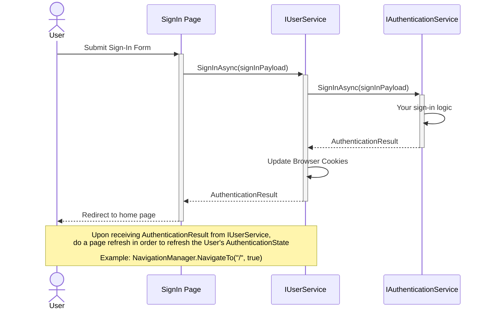
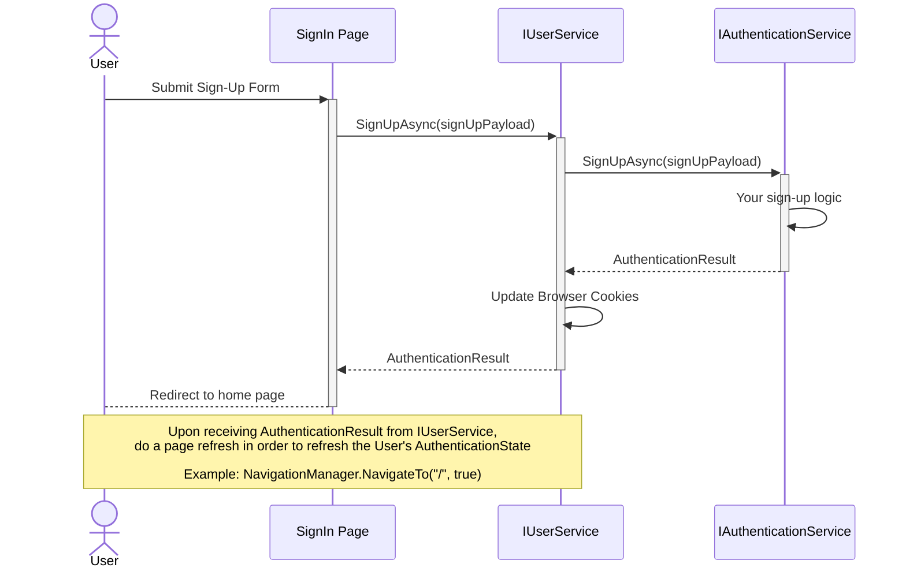
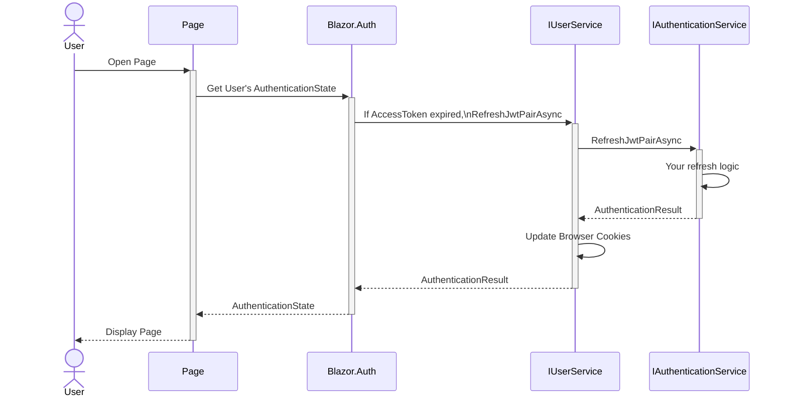

## Use Cases

### Sign-In

```mermaid
sequenceDiagram

actor user as User
participant page as SignIn Page
participant userService as IUserService
participant authService as IAuthenticationService

user ->>+ page: Submit Sign-In Form
page ->>+ userService: SignInAsync(signInPayload)
userService ->>+ authService: SignInAsync(signInPayload)
authService ->> authService: Your sign-in logic
authService -->>- userService: AuthenticationResult
userService ->> userService: Update Browser Cookies
userService -->>- page: AuthenticationResult
page -->>- user: Redirect to home page
note over user,userService: Upon receiving AuthenticationResult from IUserService, <br/> do a page refresh in order to refresh the User's AuthenticationState<br/><br/> Example: NavigationManager.NavigateTo("/", true)
```

### Sign-Up

```mermaid
sequenceDiagram

actor user as User
participant page as SignIn Page
participant userService as IUserService
participant authService as IAuthenticationService

user ->>+ page: Submit Sign-Up Form
page ->>+ userService: SignUpAsync(signUpPayload)
userService ->>+ authService: SignUpAsync(signUpPayload)
authService ->> authService: Your sign-up logic
authService -->>- userService: AuthenticationResult
userService ->> userService: Update Browser Cookies
userService -->>- page: AuthenticationResult
page -->- user: Redirect to home page
note over user,userService: Upon receiving AuthenticationResult from IUserService, <br/> do a page refresh in order to refresh the User's AuthenticationState<br/><br/> Example: NavigationManager.NavigateTo("/", true)
```

### Refresh Token

```mermaid
sequenceDiagram

actor user as User
participant page as Page
participant lib as Blazor.Auth
participant userService as IUserService
participant authService as IAuthenticationService

user ->>+ page: Open Page
page ->>+ lib: Get User's AuthenticationState
lib ->>+ userService: If AccessToken expired,\nRefreshJwtPairAsync
userService ->>+ authService: RefreshJwtPairAsync
authService ->> authService: Your refresh logic
authService -->>- userService: AuthenticationResult
userService ->> userService: Update Browser Cookies
userService -->>- lib: AuthenticationResult
lib -->>- page: AuthenticationState
page -->>- user: Display Page
```