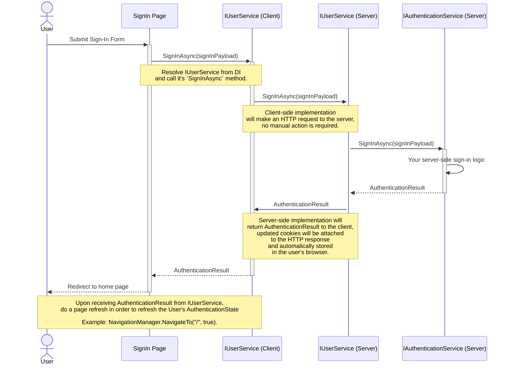
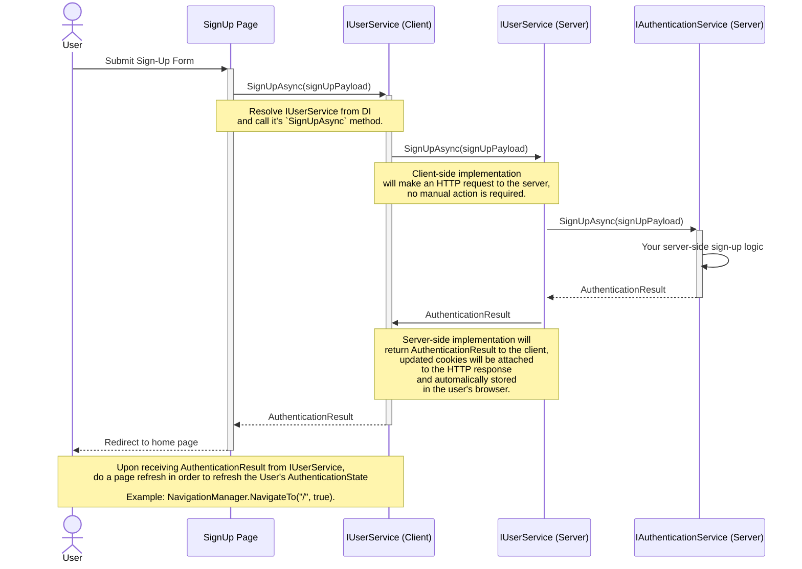

Back to [Use Cases](../04.use-cases.md)

## Interactive WebAssembly

The following sequence diagrams illustrate the use cases for Blazor.Auth in a Blazor application that is currently using interactive WebAssembly render mode:

### Sign-In

### Sign-Up

