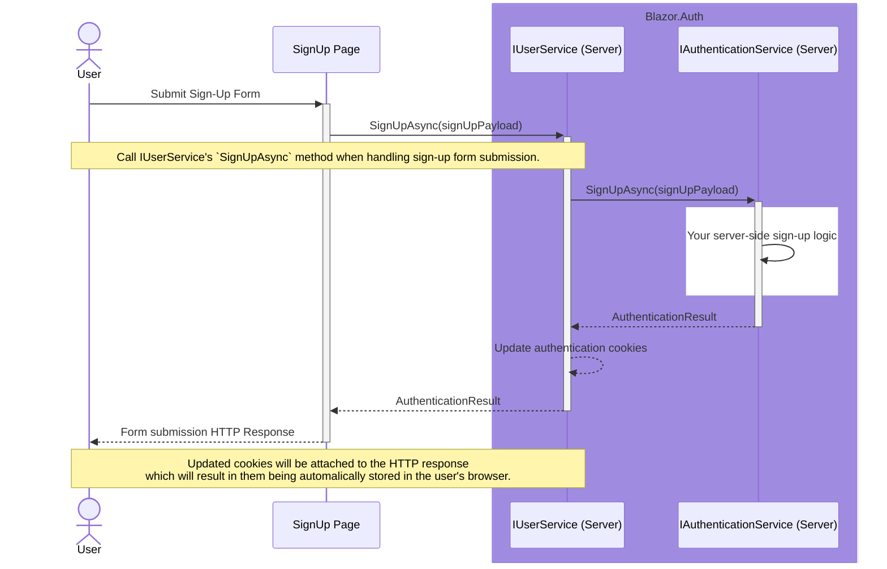
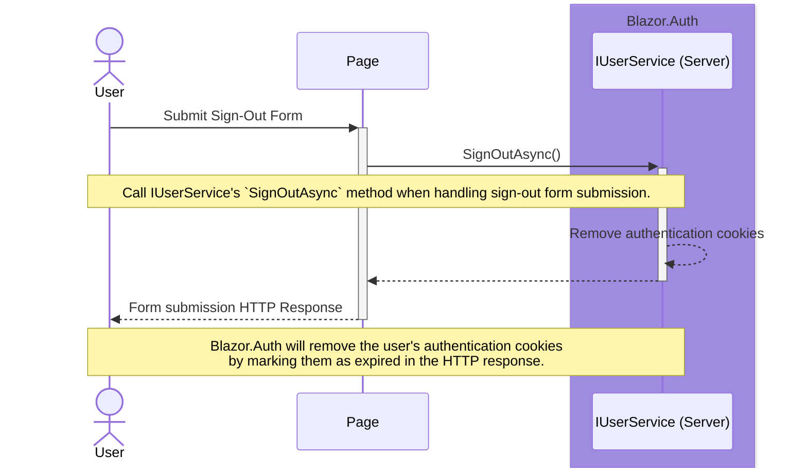

Back to [Use Cases](../04.use-cases.md)

## Static SSR

The following sequence diagrams illustrate the use cases for Blazor.Auth in a Blazor application that is currently using `Static SSR` render mode. 

For implementing these use-cases, an approach utilizing form submission is used. For more information on how Blazor handles form submission in Static SSR, refer to [Blazor Documentation](https://learn.microsoft.com/en-us/aspnet/core/blazor/forms/#handle-form-submission). 

### Sign-In

### Sign-Up

### Sign-Out

