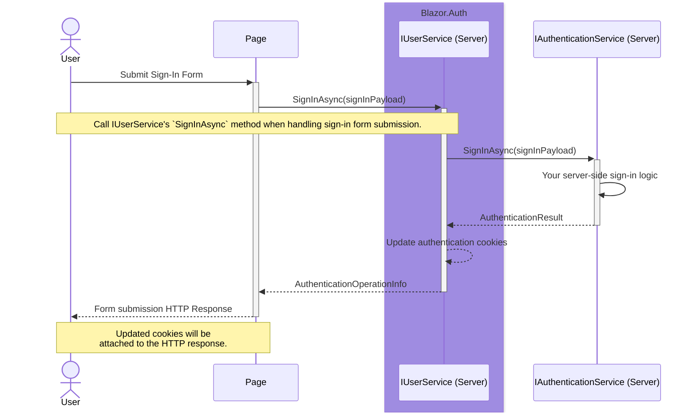
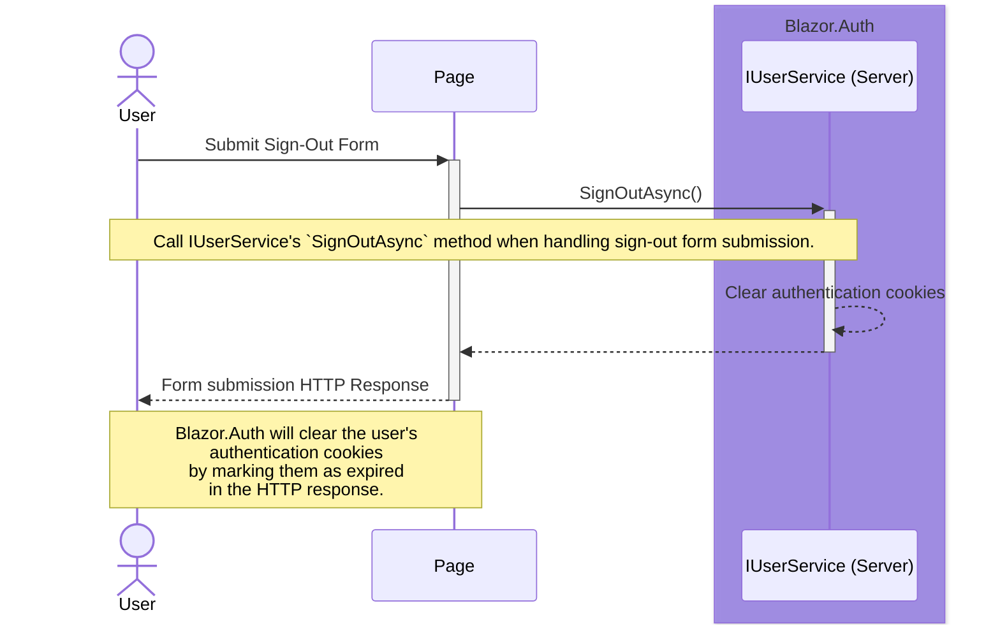
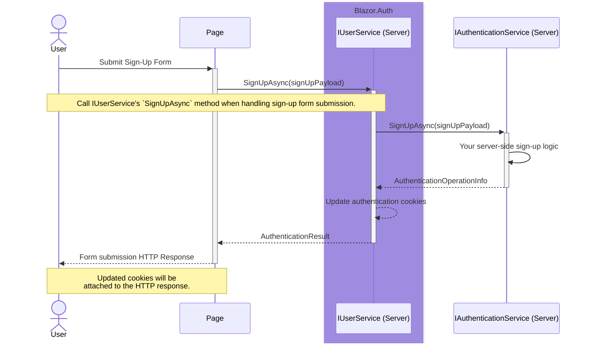

Back to [Use Cases](../04.use-cases.md)

## Static SSR

The following sequence diagrams illustrate the use cases for Blazor.Auth in a Blazor application that is currently using `Static SSR` render mode. 

For the purposes of these sample flows, an approach utilizing form submission is used. For more information on how Blazor handles form submission in Static SSR, refer to [Blazor Documentation](https://learn.microsoft.com/en-us/aspnet/core/blazor/forms/#handle-form-submission). You can use any other approach, as long as it is compatible with Static SSR. Just resolve the `IUserService` from the DI container and call it's appropriate method - Blazor.Auth will take care of the rest.

### Sign-In

### Sign-Out

### Sign-Up

